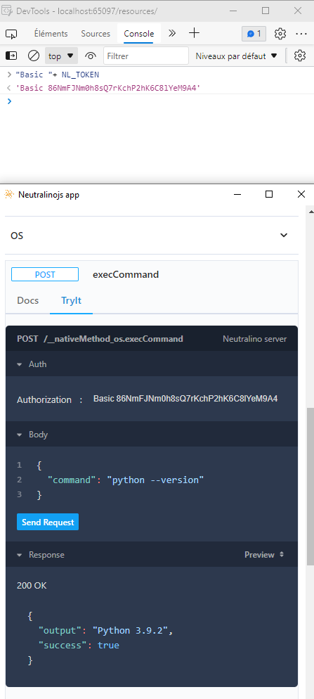

Sources:

- `api/*.yaml` are the API sources

Generated contents:

- `api/*.json` are resolved APIs (`make json-api`).
- `api/*.d.ts` are the API interfaces, (`make typings`).

To manually test the server:

- `make test-app`
  (You must have the neutralinojs repository in the parent of it).
- `neu run`.
- Write the basic authorization token in the header field

