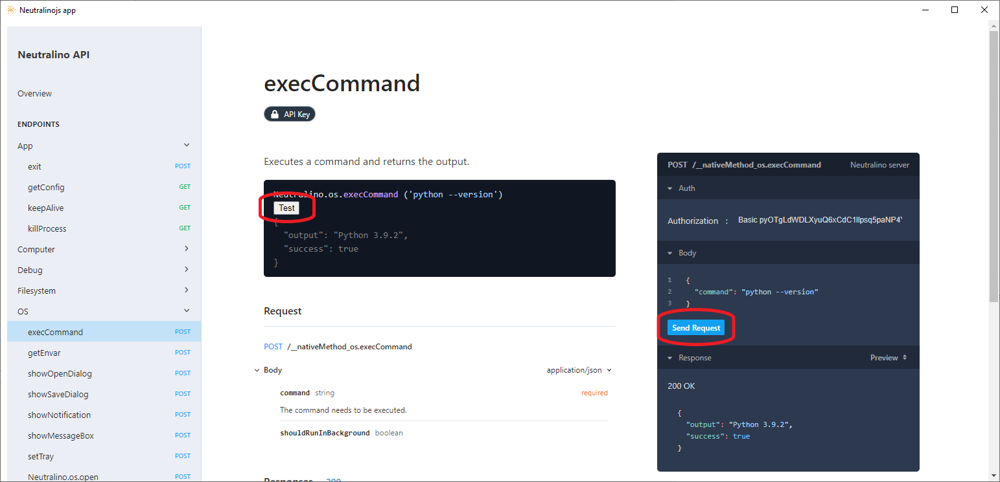
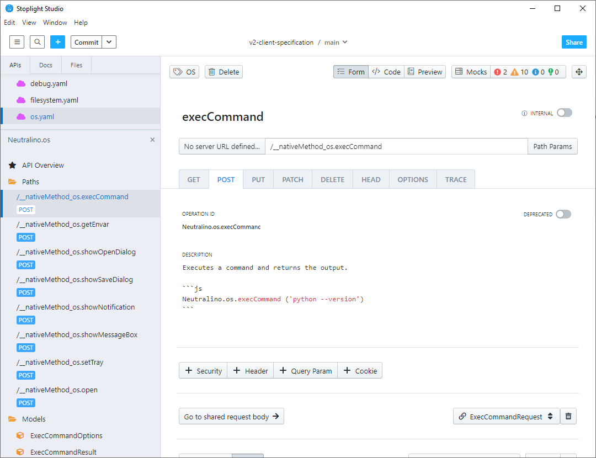

## To manually test the server with an interface:

- `make app`

  This creates a standard Neutralino application \
  (You must have the neutralinojs repository in the parent of it).

- `neu run`
  
  Displays `/src/index.html`. 

  There are two ways to test the server, with the client API or by sending messages directly.

  

## Modify API 

- `make json-watch`

  to automatically build the `/src/api.json` file based on the `/src/*.yaml` definitions

- edit YAML files

  since `neu run` launches Neutralino in debug mode, it is therefore possible to run this command to have a direct update of the modifications.

  An easy way to change the definitions is to use Stoplight studio:
  
  

  > Note: In these cases, it may take a few seconds to update the changes directly.

## TODO

- Add type checking to the 'request' function

  Currently the type generator is done with `make json && make typings`
  and a proof of concept is made in [`./http.ts`](./http.ts)